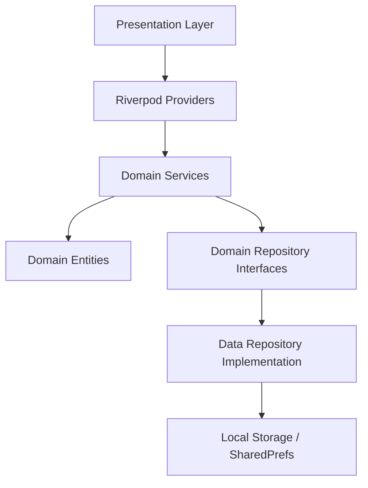
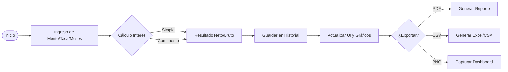
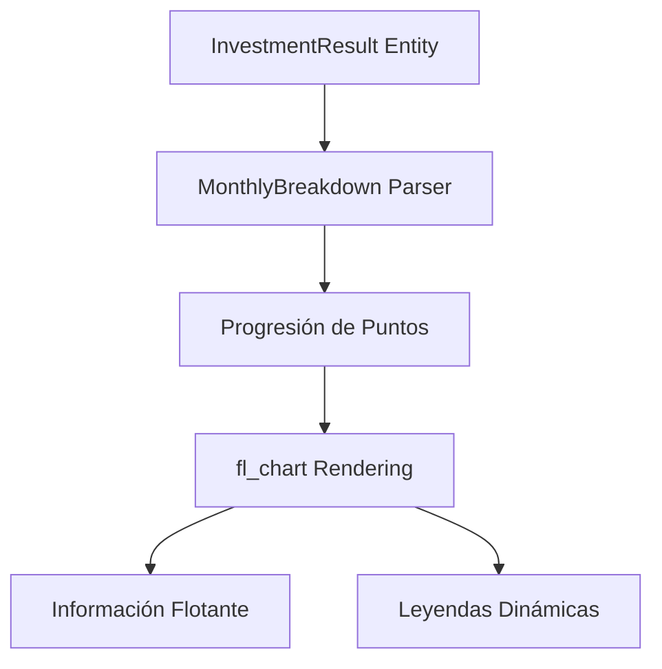
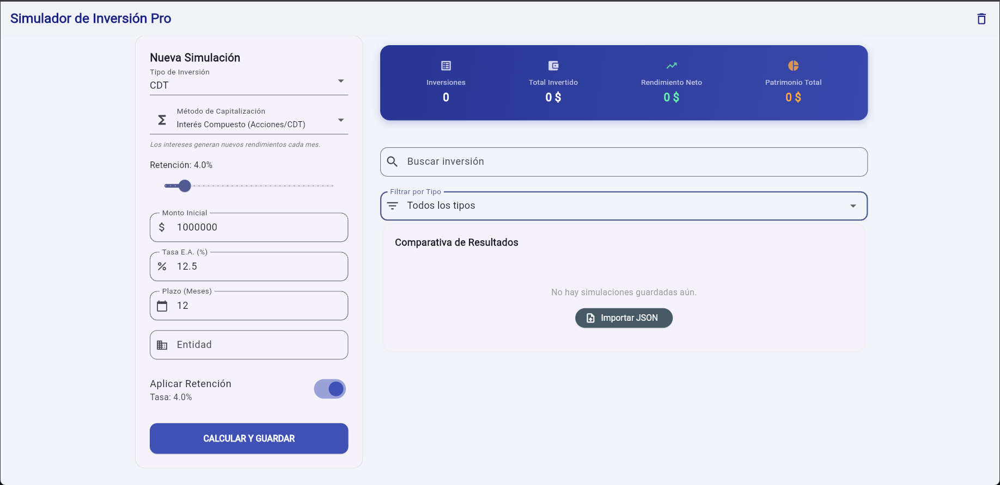
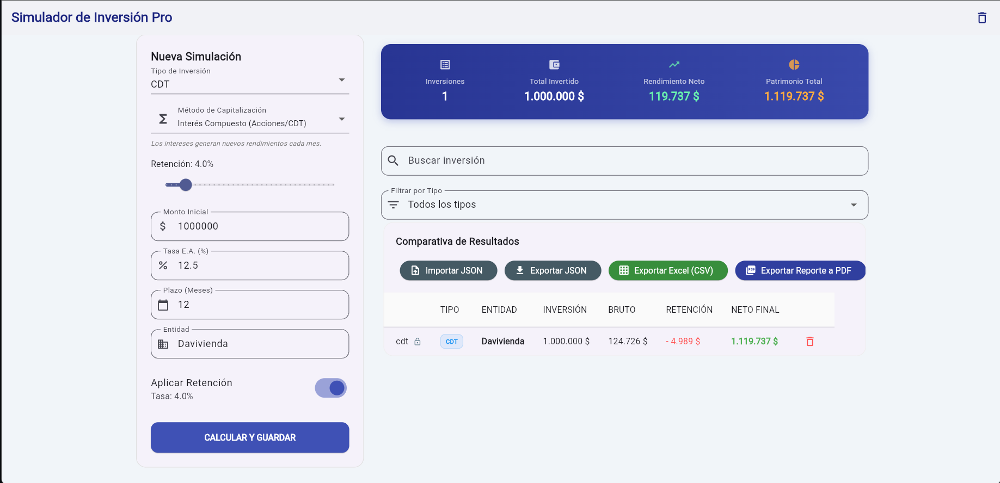
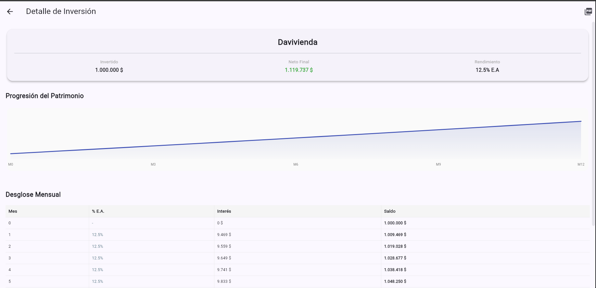
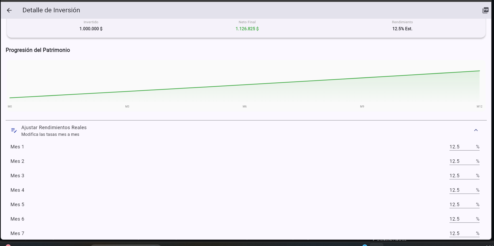

# Investment Simulator Pro 📈💰

Una aplicación robusta desarrollada específicamente para **Flutter WEB** diseñada para simular, comparar y analizar diferentes tipos de inversiones financieras (CDT, Acciones, Fondos). Este proyecto implementa **Clean Architecture**, gestión de estado con **Riverpod**, y generación de reportes detallados en entorno web.

---

## 📖 Tabla de contenidos
- [🌐 Optimización Web](#-optimización-web)
- [🎯 Objetivo](#-objetivo)
- [🛠️ Stack Tecnológico](#️-stack-tecnológico)
- [🏗️ Arquitectura](#️-arquitectura)
- [⚙️ Flujo Funcional](#️-flujo-funcional)
- [📊 Lógica de Gráficos](#-lógica-de-gráficos)
- [🎨 UI & Diseño](#-ui--diseño)
- [📂 Estructura del Proyecto](#-estructura-del-proyecto)
- [🚀 Características Principales](#-características-principales)
- [🔧 Instalación](#-instalación)
- [👤 Autor](#-autor)

---

## 🌐 Optimización Web
Esta aplicación ha sido diseñada y optimizada pensando en la experiencia de escritorio en el navegador:
- **Layout Responsivo:** Diseño tipo Dashboard optimizado para pantallas anchas.
- **Exportación Directa:** Manejo de descargas de PDF y CSV nativo del navegador.
- **Rendimiento:** Implementación de persistencia local optimizada para entornos web.
- **Interacción:** Navegación y herramientas de captura adaptadas al uso de mouse y teclado.

---

## 🎯 Objetivo
El propósito de esta herramienta es permitir a los usuarios realizar proyecciones financieras precisas, facilitando la toma de decisiones informadas a través de:
- Simulación de intereses simples y compuestos.
- Comparativa visual entre diferentes instrumentos financieros.
- Cálculo automático de retenciones e impuestos.
- Exportación de resultados a formatos PDF y CSV.

---

## 🛠️ Stack Tecnológico
- **Framework:** Flutter 3.x
- **Gestión de Estado:** Riverpod (Generator)
- **Modelado de Datos:** Freezed & JSON Serializable
- **Gráficos:** fl_chart
- **Persistencia:** Shared Preferences
- **Reportes:** pdf & printing
- **Utilerías:** Intl, CSV, UUID, Path Provider

---

## 🏗️ Arquitectura
El proyecto sigue los principios de **Clean Architecture**, separando las responsabilidades en capas para garantizar escalabilidad y mantenibilidad.



---

## ⚙️ Flujo Funcional
Proceso desde la entrada de datos hasta la persistencia y reporte.



---

## 📊 Lógica de Gráficos
El motor de visualización transforma los datos calculados en puntos de progresión mensual.



---

## 🎨 UI & Diseño
Interfaz moderna basada en **Material 3** con una experiencia de usuario optimizada para la toma de decisiones financieras.

### 📸 Screenshots
> [!TIP]
> Vista detallada de la interfaz de usuario optimizada para la web.

| Dashboard Principal | Comparativa de Inversiones | Detalle Mensual (CDT/FONDO) | Detalle Mensual (ACCIONES) |
| :---: | :---: | :---: | :---: |
|  |  |  |  |

---

## 📂 Estructura del Proyecto
```text
D:.
|   .gitignore
|   analysis_options.yaml
|   pubspec.yaml
|   README.md
|
+---lib
|   |   main.dart
|   |
|   +---core
|   |   \---utils
|   |           capture_png_helper.dart
|   |           download_helper.dart
|   |           formatters.dart
|   |
|   +---data
|   |   \---repositories
|   |           local_investment_repository.dart
|   |
|   +---domain
|   |   +---entities
|   |   |       investment_data.dart
|   |   |       investment_data.freezed.dart
|   |   |       investment_data.g.dart
|   |   |
|   |   +---repositories
|   |   |       investment_repository.dart
|   |   |
|   |   \---services
|   |           pdf_service.dart
|   |
|   \---presentation
|       +---providers
|       |       filter_provider.dart
|       |       investment_provider.dart
|       |
|       +---screens
|       |       comparison_screen.dart
|       |       investment_detail_screen.dart
|       |       web_simulator_screen.dart
|       |
|       \---widgets
|               responsive_dashboard.dart
|
+---test
\---web
    |   index.html
    |   manifest.json
    \---icons/
```

---

## 🚀 Características Principales
- **Simulación Avanzada:** Soporta CDT, Acciones y Fondos de inversión.
- **Métodos de Cálculo:** Alterna entre Interés Simple y Compuesto.
- **Comparativa Múltiple:** Analiza hasta 5 inversiones simultáneamente.
- **Exportación Multi-formato:** PDF, CSV y capturas PNG.
- **Gráficos Interactivos:** Visualización de la curva de crecimiento del capital.

---

## 🔧 Instalación

1. **Clonar repositorio:**
   ```bash
   git clone https://github.com/tu-usuario/simulador_inversion.git
   ```

2. **Instalar dependencias:**
   ```bash
   flutter pub get
   ```

3. **Generar código:**
   ```bash
   dart run build_runner build --delete-conflicting-outputs
   ```

---

## 👤 Autor
Desarrollado por [Geral Torres](https://github.com/geraltorres) 🏍️ 💨

---
© 2026 Inversión Pro.
